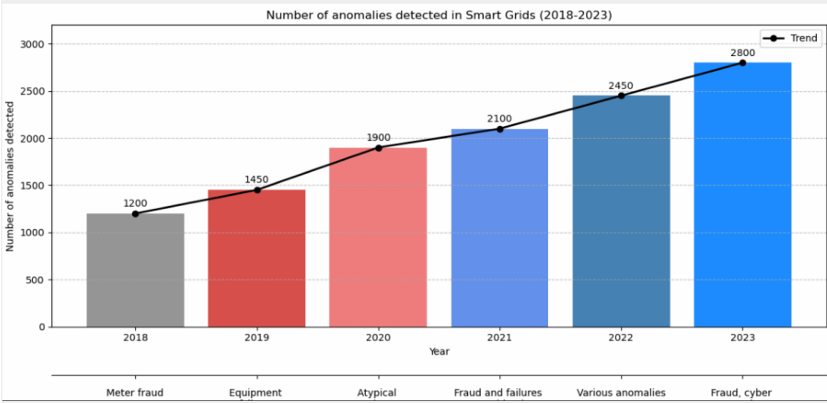
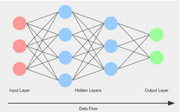
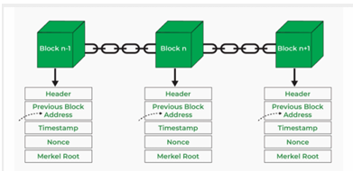
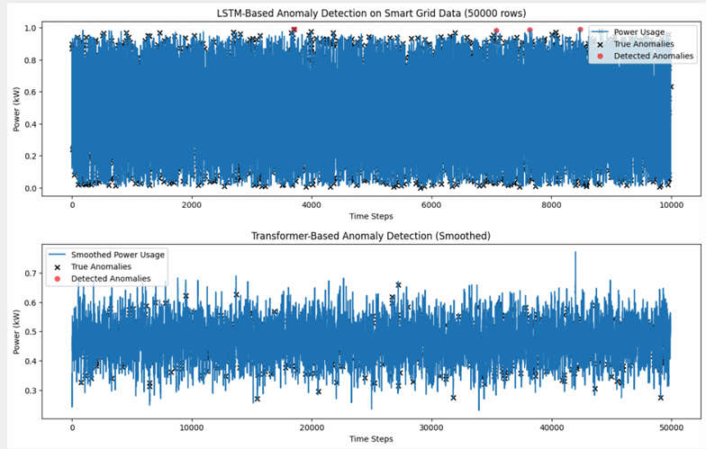

⚡ Smart Grid Anomaly Detection with Blockchain

This repository focuses on preparing and processing smart grid data for anomaly detection within a blockchain-enabled environment. It combines real and synthetic datasets, machine learning models (LSTM & Transformer), and blockchain-compatible data formatting to ensure secure, traceable, and analyzable energy data.

🚀 Key Features

🧹 Data Preparation: Cleaning, normalization, timestamp formatting, anomaly labeling 
⚡ Anomaly Simulation: Synthetic DoS, energy theft, and equipment failures 
🔗 Blockchain Formatting: Data structured into blocks with SHA-256 hashes for immutability 
🤖 Machine Learning: LSTM & Transformer models for temporal anomaly detection 
📊 Visualization: Exploratory data analysis and anomaly trend visualization 

⚠️Problem Statement
Smart grids rely on IoT devices for energy management, but increased connectivity introduces vulnerabilities. 
Cyberattacks (Distributed Denial of Service) 
Energy Theft (Meter fraud) 
System Failures (Atypical equipment behavior) 
 
The Challenge: How to keep energy data both secure from tampering and reliably monitored for subtle anomalies? 

## 🏗 System Architecture

The solution operates in **two main layers**:

### 1️⃣ AI Layer
- Analyzes time-series data (Voltage, Current, Power).  
- Detects complex, non-linear patterns indicative of attacks or failures.

### 2️⃣ Blockchain Layer
- Securely records the data and analysis results.  
- Uses a linked-list structure where every block contains the hash of the previous block.  
- Any modification to historical data breaks the chain, alerting the system.

📊 Data Sources
To build a robust model, we utilized a combination of real and synthetic data: 
Real Dataset: Sourced from Kaggle (~50,000 records) containing actual smart grid monitoring metrics. 
Synthetic Dataset: Generated via Python to simulate specific attack scenarios often missing from public data, such as: 
DoS Attacks 
Equipment Breakdowns 

📂 Repository Structure

data/        # Raw and processed datasets

notebooks/   # Analysis and modeling notebooks

scripts/     # Preprocessing, data generation, blockchain formatting

🛠️ Technologies

🐍 Python: Pandas, NumPy, Matplotlib, Seaborn 
🤖 Machine Learning: TensorFlow, PyTorch, Scikit-Learn 
🔒 Blockchain: SHA-256 hashing for block integrity 

📈 Results & Evaluation

We compared the performance of LSTM and Transformer models on a dataset of 50,000 records. 
| Metric               | LSTM Model                  | Transformer Model         | Status                  |
|----------------------|----------------------------|--------------------------|------------------------|
| AUC Score            | 0.85 (Good)                | 0.91 (Excellent)         | ✅ Transformer Wins     |
| False Positive Rate  | 0.15                        | 0.09                     | ✅ Transformer Wins     |
| Scalability          | Slower on long sequences   | Highly Scalable          | ✅ Transformer Wins     |

🔮 Future Work

Implement real-time data streaming support. 
Test hybrid LSTM-Transformer architectures. 
Deploy the blockchain layer on a live decentralized network (e.g., Ethereum or Hyperledger). 

🌟 Highlights

Bridges IoT, ML, and blockchain for smart grid anomaly detection 
Ensures secure, tamper-proof, and traceable datasets 
Supports LSTM and Transformer models for real-time anomaly detection

👥 Contributors

Presented by:
Cyrine Chalghoumi - Engineering Student 
Supervisors:
Imen Aouini/
Radhia Werghemmi
